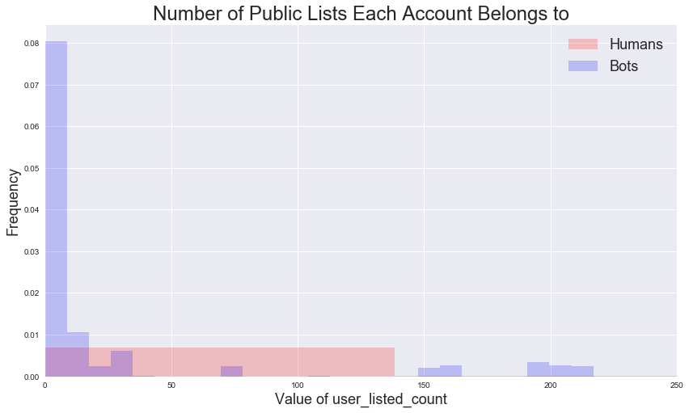

# Exploratory Data Analysis Visualizations and Remarks


```python
# Basic tools
import warnings
warnings.filterwarnings('ignore')
import numpy as np
import pandas as pd
import matplotlib
import matplotlib.pyplot as plt
import seaborn as sns
from pandas.core import datetools
from pandas.plotting import scatter_matrix
%matplotlib inline
# import nbconvert
# import statsmodels.api as sm
# from statsmodels.api import OLS

# # Preprocessing tools
# from sklearn                import preprocessing
# from sklearn.preprocessing  import PolynomialFeatures
# from sklearn.preprocessing  import StandardScaler
# from sklearn.preprocessing  import Imputer

# # Metrics tools
# from sklearn                import metrics
# from sklearn.metrics        import confusion_matrix
# from sklearn.metrics        import mean_squared_error
# from sklearn.metrics        import accuracy_score
# from sklearn.metrics        import confusion_matrix
# from sklearn.metrics        import r2_score

# # Discriminant Analysis tools
# from sklearn.discriminant_analysis import LinearDiscriminantAnalysis
# from sklearn.discriminant_analysis import QuadraticDiscriminantAnalysis

# # Model selection tools
# from sklearn.model_selection import cross_val_score
# from sklearn.model_selection import LeaveOneOut
# from sklearn.model_selection import KFold
# from sklearn.model_selection import train_test_split

# # Linear Regression Models
# from sklearn.linear_model    import Ridge
# from sklearn.linear_model    import Lasso
# from sklearn.linear_model    import RidgeCV
# from sklearn.linear_model    import LassoCV
# from sklearn.linear_model    import LinearRegression
# from sklearn.linear_model    import LogisticRegression
# from sklearn.linear_model    import LogisticRegressionCV

# # Classifiers
# from sklearn.neighbors       import KNeighborsClassifier
# from sklearn.tree            import DecisionTreeClassifier

```


```python
def split_X_y(filename):
    df=pd.read_csv(filename,index_col=0)
    return df.drop('bot_or_not',axis=1), df.bot_or_not


def how_many_uniques(df):
    for col in df.columns:
        try:
            print(col,len(df[col].unique()))
        except:
            print(col, "length undefined")
    return None
```


```python
# Plot histogram comparison of Bots vs Humans
def hist_bot_vs_hum(predictor, title=None, bins=25, normed=True,
                    xmin=None,xmax=None, ymin=None,ymax=None):
    fig, ax = plt.subplots(figsize=(14,8))
    if title:
        ax.set_title(title, fontsize=24)

    if (xmin!=None) & (xmax!=None):
        ax.set_xlim(xmin,xmax)

    if (ymin!=None) & (ymax!=None):
        ax.set_ylim(ymin,ymax)

    if normed:
        ax.set_ylabel("Frequency", fontsize=18)
    else:
        ax.set_ylabel("Counts", fontsize = 18)

    ax.hist(hum_X_train[predictor], bins=bins, normed=normed,
            label="Humans", color='r', alpha = 0.2)

    ax.hist(bot_X_train[predictor], bins=bins, normed=normed,
            label="Bots", color='b', alpha = 0.2)

    ax.set_xlabel("Value of "+predictor, fontsize=18)

    ax.grid(True, '--',alpha=0.2)
    ax.legend(fontsize=18, loc=1)


```


```python
X_train, y_train = split_X_y("BASELINE_train.csv")
```


```python
hum_X_train = X_train.loc[y_train[y_train==0].index]
hum_y_train = y_train.loc[y_train[y_train==0].index]

bot_X_train = X_train.loc[y_train[y_train==1].index]
bot_y_train = y_train.loc[y_train[y_train==1].index]
```

## Draw Histograms


```python
hist_bot_vs_hum('user_listed_count',
                "Number of Public Lists Each Account Belongs to",
                bins=25,normed=True, xmin=0, xmax=250)
```





## Draw Scatter Plots


```python
visual_bot_vs_hum(['upper','retweet_count'],"Number of Retweets vs. Number of Uppercase Words", hum=1,ylim=300000)
```


    ---------------------------------------------------------------------------

    NameError                                 Traceback (most recent call last)

    <ipython-input-8-3123d597a407> in <module>()
    ----> 1 visual_bot_vs_hum(['upper','retweet_count'],"Number of Retweets vs. Number of Uppercase Words", hum=1,ylim=300000)


    NameError: name 'visual_bot_vs_hum' is not defined


```python
scatter_matrix(hum_X_train);
```
