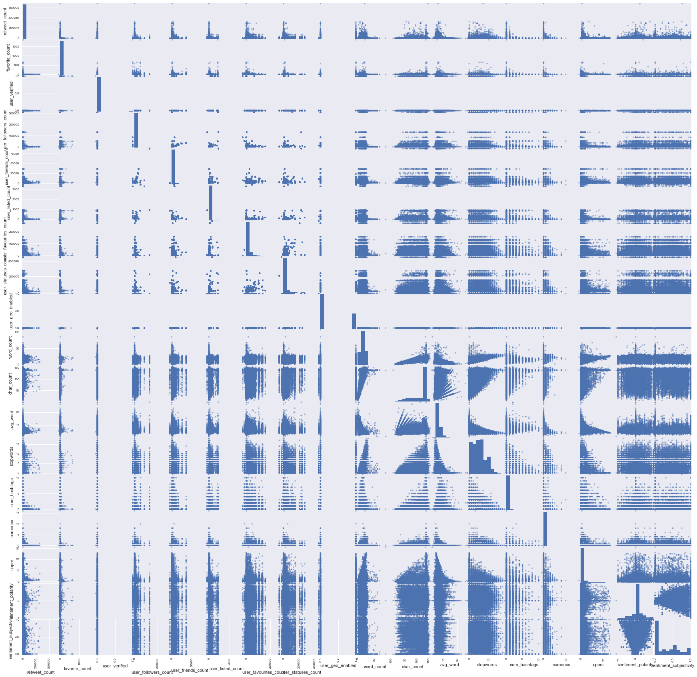
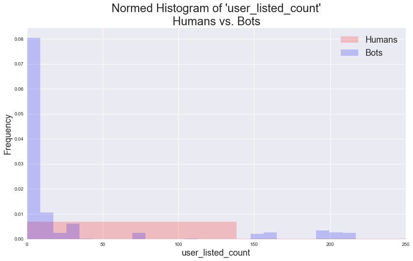
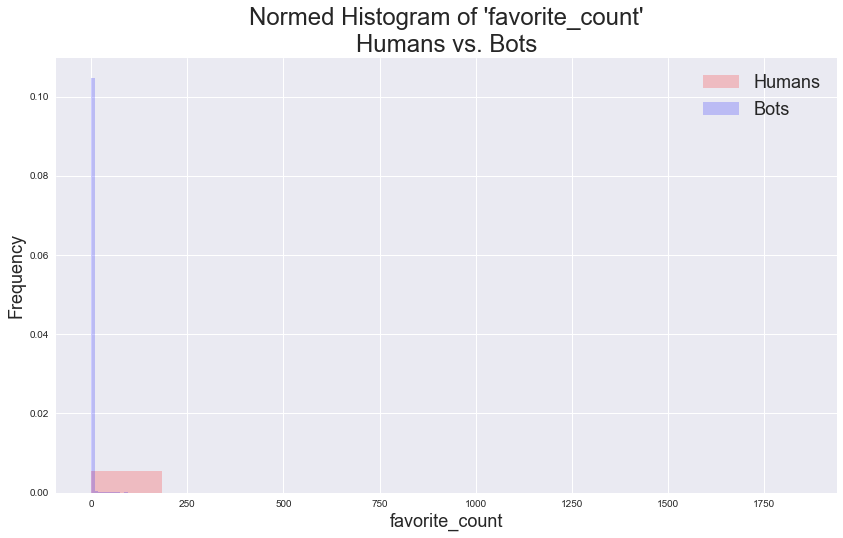
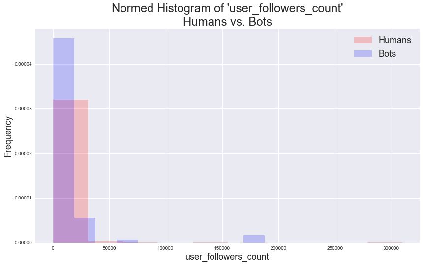
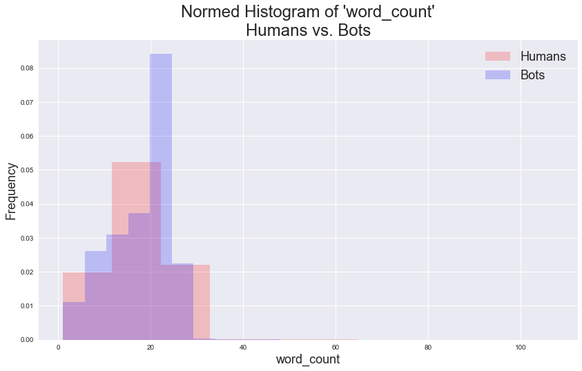
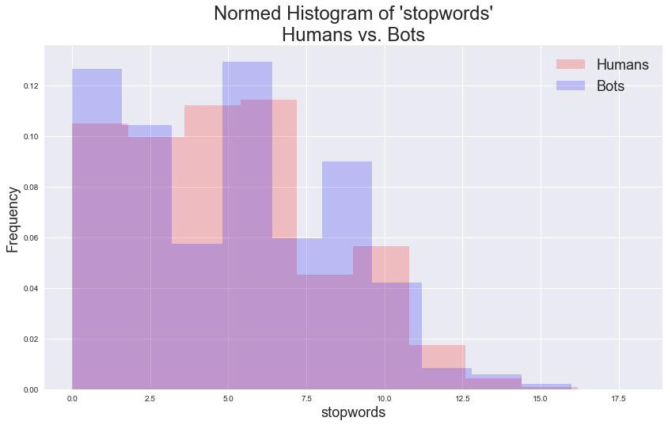
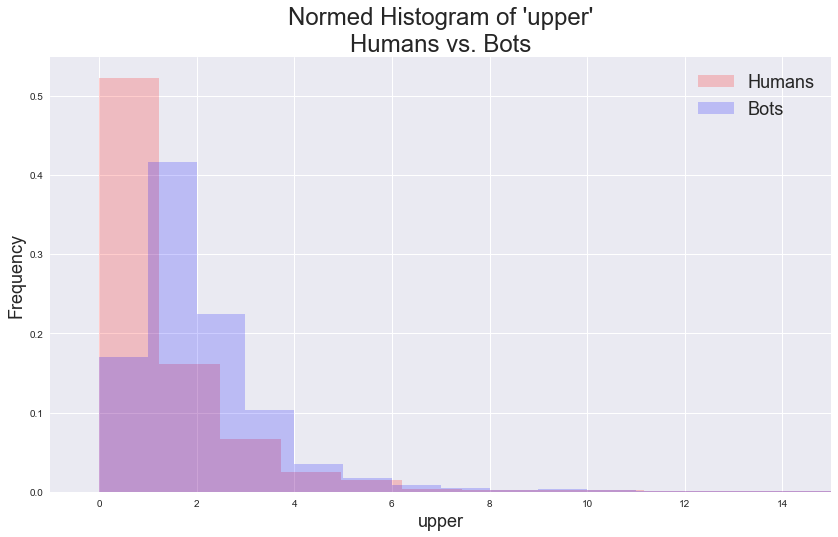
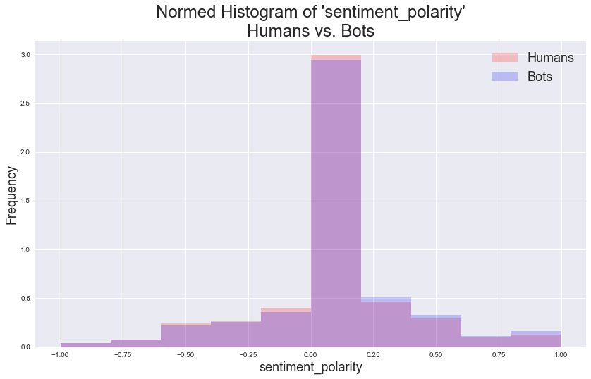
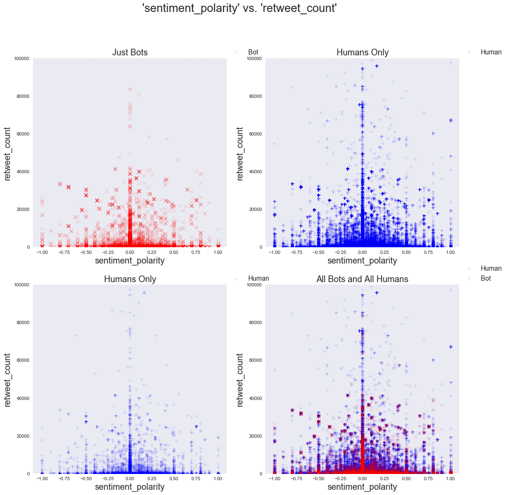
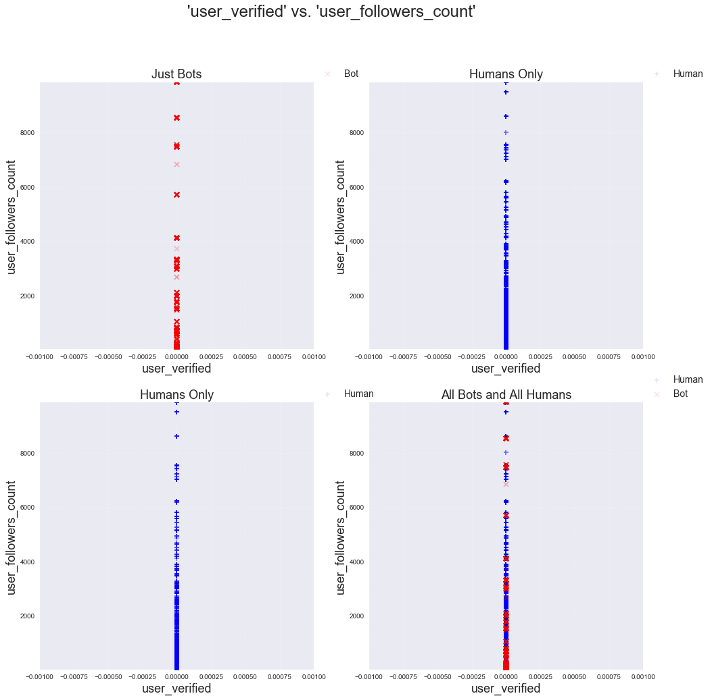

# EDA Visualizations and Remarks


```python
# Basic tools
import warnings
warnings.filterwarnings('ignore')
import numpy as np
import pandas as pd
import matplotlib
import matplotlib.pyplot as plt
import seaborn as sns
from pandas.core import datetools
from pandas.plotting import scatter_matrix
from sklearn.utils import resample
import seaborn as sns

%matplotlib inline
```


```python
# Load csv file into Dataframe and split into features and labels
def split_X_y(filename):
    # Read csv files in to pandas dataframe
    df=pd.read_csv(filename,index_col=0)

    # return DataFrame object with labels dropped, and a Series object of labels
    return df.drop('bot_or_not',axis=1), df.bot_or_not


# Plot histogram comparison of Bots vs Humans
def hist_bot_vs_hum(predictor, title=None, bins=25, normed=True,
                    xmin=None,xmax=None, ymin=None,ymax=None):
    fig, ax = plt.subplots(figsize=(14,8))
    if title:
        ax.set_title(title, fontsize=24)
    else:
        ax.set_title("Normed Histogram of '"+predictor+"'\nHumans vs. Bots", fontsize=24)

    if (xmin!=None) & (xmax!=None):
        ax.set_xlim(xmin,xmax)

    if (ymin!=None) & (ymax!=None):
        ax.set_ylim(ymin,ymax)

    if normed:
        ax.set_ylabel("Frequency", fontsize=18)
    else:
        ax.set_ylabel("Counts", fontsize = 18)

    ax.hist(hum_X_train[predictor], bins=bins, normed=normed,
            label="Humans", color='r', alpha = 0.2)

    ax.hist(bot_X_train[predictor], bins=bins, normed=normed,
            label="Bots", color='b', alpha = 0.2)

    ax.set_xlabel(predictor, fontsize=18)

    ax.grid(True, '--',alpha=0.2)
    ax.legend(fontsize=18, loc='best')


# Create four scatterplots based on col1 and col2
# Top-Left       : All Humans Data
# Top-Right      : All Bots Data
# Bottom-Left    : All Humans and All Bots
# Bottom-Right   : All Bots and Equal Number of Humans (randomly sampled)
def visual_bot_vs_hum(col1,col2, xmin=None, xmax=None,ymin=None,ymax=None):
    fig,ax=plt.subplots(2,2,figsize=(16,16))
    fax=ax.ravel()

    fig.suptitle("'"+col1+"' vs. '"+col2+"'", fontsize=24)
    prop_sample=resample(hum_X_train, replace=False, n_samples=len(bot_X_train))


    fax[0].scatter(bot_X_train[col1],bot_X_train[col2],
               marker='x', alpha=0.1, color='r', label='Bot')
    fax[0].set_title("Just Bots", fontsize=18)


    fax[1].scatter(hum_X_train[col1],hum_X_train[col2],
               marker='+', alpha=0.1, color='b', label="Human")
    fax[1].set_title("Humans Only", fontsize=18)


    fax[2].scatter(prop_sample[col1],prop_sample[col2],
               marker='+', alpha=0.1, color='b', label="Human")
    fax[2].set_title("Humans Only", fontsize=18)

#     fax[2].scatter(prop_sample[col1],prop_sample[col2],
#                marker='+', alpha=0.1, color='b', label="Human")
#     fax[2].scatter(bot_X_train[col1],bot_X_train[col2],
#                marker='x', alpha=0.1, color='r', label='Bot')
#     fax[2].set_title("Equal Number of Humans and Bots", fontsize=18)


    fax[3].scatter(hum_X_train[col1],hum_X_train[col2],
               marker='+', alpha=0.1, color='b', label="Human")
    fax[3].scatter(bot_X_train[col1],bot_X_train[col2],
               marker='x', alpha=0.1, color='r', label='Bot')
    fax[3].set_title("All Bots and All Humans", fontsize=18)


    for i in range(4):
        fax[i].legend(fontsize=14,loc=(1,1))
        fax[i].grid(True, alpha=0.2, ls='--')
        fax[i].set_xlabel(col1, fontsize=18)
        fax[i].set_ylabel(col2, fontsize=18)
        if (xmin==None) & (xmax==None):
            fax[i].set_xlim(np.percentile(hum_X_train[col1], 5), np.percentile(hum_X_train[col1],95))
        else:
            fax[i].set_xlim(min(0,xmin),xmax)
        if (ymin==None) & (ymax==None):
            fax[i].set_ylim(np.percentile(hum_X_train[col2], 5), np.percentile(hum_X_train[col2],95))        
        else:
            fax[i].set_ylim(min(0,ymin),ymax)


```


```python
X_train, y_train = split_X_y("BASELINE_train.csv")
```


```python
hum_X_train = X_train.loc[y_train[y_train==0].index]
hum_y_train = y_train.loc[y_train[y_train==0].index]

bot_X_train = X_train.loc[y_train[y_train==1].index]
bot_y_train = y_train.loc[y_train[y_train==1].index]


columns= hum_X_train.columns
len(columns)
```


    18


## Scatter Matrix


```python
scatter_matrix(hum_X_train, figsize=(30,30));
```





# Histograms


```python
sns.distplot?
```


```python
hist_bot_vs_hum('user_listed_count',
                bins=25,normed=True, xmin=0, xmax=250)
```





Figure 1. The plot above shows a stark difference between bots and humans in their list joining behavior. Bots seem to either join no lists or join a bunch with few inbetween.

----


```python
hist_bot_vs_hum('char_count',normed=True)
```


Figure 24. Given that tweets have a 140-character limit, bots might be taking better care to ensure that their tweets stay within the allowed character limits. Perhaps a bit better than humans do.

----


```python
hist_bot_vs_hum(columns[1],normed=True)
```





```python
hist_bot_vs_hum(columns[2],normed=True)
```


The plot above 'user_verified' is an indicator variable. This plot interestingly shows that bots never verify their accounts.

----


```python
hist_bot_vs_hum(columns[3],normed=True)
```





```python
hist_bot_vs_hum(columns[4],normed=True)
```


```python
hist_bot_vs_hum(columns[5],normed=True)
```


```python
hist_bot_vs_hum(columns[6],normed=True)
```


```python
hist_bot_vs_hum(columns[7],normed=True)
```


```python
hist_bot_vs_hum(columns[8],normed=True)
```


```python
hist_bot_vs_hum(columns[9],normed=True)
```





```python
hist_bot_vs_hum(columns[10],normed=True)
```


```python
hist_bot_vs_hum(columns[11],normed=True)
```


Figure 25. The distribution of average word length looks to be similar between bots and humans. This suggests that bots are capable of creating sentences that closely resemble human created sentences.

----


```python
hist_bot_vs_hum(columns[12],normed=True)
```





Figure 26. Bots seem to be better at keeping the number of stopwords at a minimum. This may be because bots are mindful of the 140 character space.

----


```python
hist_bot_vs_hum(columns[13],normed=True)
```


```python
hist_bot_vs_hum(columns[14],normed=True)
```


```python
hist_bot_vs_hum(columns[15],normed=True, xmin=-1,xmax=15)
```





Figure 27. Bots show a trend of using at least one upper-case word in their tweets. Humans, on the other hand usually do not use any upper case words in their tweets.

----


```python
hist_bot_vs_hum(columns[16],normed=True)
```





Figure 28. This plot shows how similar the distributions of our sentiment predictors are for humans and bots. Figure 30 also shows a strikingly similar distribution.

----


```python
hist_bot_vs_hum(columns[17],normed=True)
```


Figure 29. That the distributions are so similar may suggest that sentiment polarity and sentiment subjectivity may not be well suited for discerning bots from humans.

----


# Scatter Plots

### Sentiment Polarity vs. Retweet Count


```python
visual_bot_vs_hum('sentiment_polarity','retweet_count', xmin=-1.1, xmax=1.1, ymin=0,ymax=100000)
```





Figure 30. This plot and the plot in Figure 24 were picked to point out that humans have tweets of sentiment polarity equal or close to 1 that have been retweeted more than 60,000 times, which may be considered having gone viral.

Figure 31. Bots, on the other hand show the same region as being empty. This may suggest that bots are unable or perhaps unwilling to generate a tweet of positive polarity, thus resulting in no viral tweets in the same region in the plot.

----

----

Stopwords vs Averge Number of Words


```python
visual_bot_vs_hum('avg_word','stopwords', xmin=-0.1, xmax=20.1, ymin=-0.1,ymax=20)
```


Figure 32. The number of stopwords in relation to average word length seems to be more tightly distributed for bots than for humans. This may be indicative of how machines calculate their tweets.

----


```python
columns[5]
```


    'user_listed_count'


### Retweet Count vs. User Statuses Count


```python
visual_bot_vs_hum(columns[0],columns[7])
```


There seems to be discrete levels to the number of tweets (statuses) bots create. Comparing the left plots (top and bottom), it can be seen that the number of tweets created by bots take on discrete levels (see top left y-axis in red), whereas human created tweets are in numbers that densely populate the entire range. This may be due to coordinated activity by bots controlled by a single group of actors. It might be worthwhile looking into whether each discrete level corresponds to the same group of Twitter users, which, if verified, would strongly indicate that a single user controls them all.

----


```python
visual_bot_vs_hum(columns[2],columns[3])
```





There seems to be discrete levels in bots for the y-axis, whereas humans show a continuous distribution. The implications of the number of followers a user has should be looked into further for coordinated efforts made by Twitter accounts controlled by a single group or user.

----


```python
visual_bot_vs_hum(columns[5],columns[16])
```


Notice the vertical bands shown in the top-left plot. There is an especially distinct vertical band at approximately 70 for user_listed_count. This band seems to be unique to bots as humans do not show much of a vertical pattern. It may be worthwhile looking into.


```python
visual_bot_vs_hum(columns[5],columns[17])
```


Notice the same vertical bands shown here again in the top-left plot. There is an especially distinct vertical band at approximately 70 for user_listed_count. This band seems to be unique to bots as humans do not show much of a vertical pattern.
