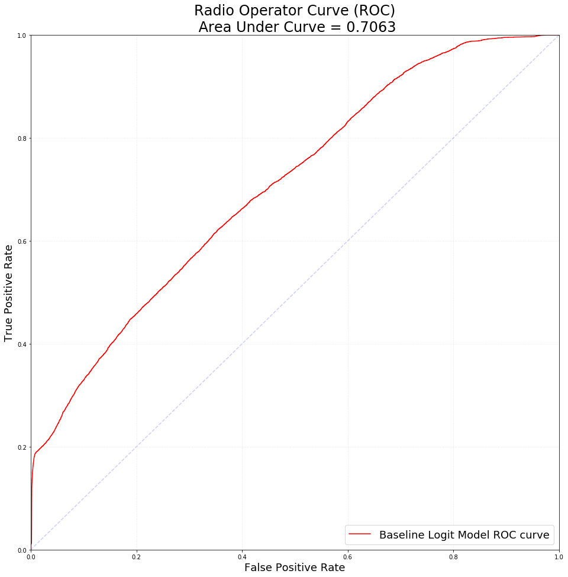
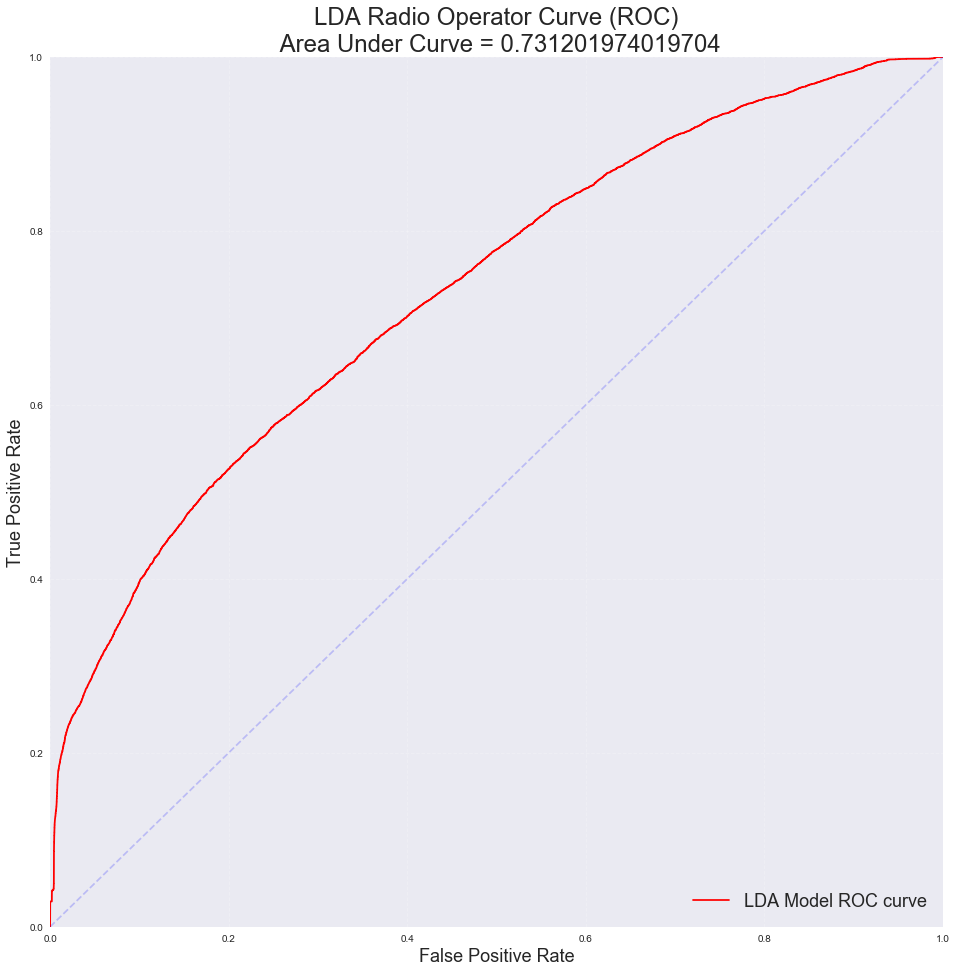
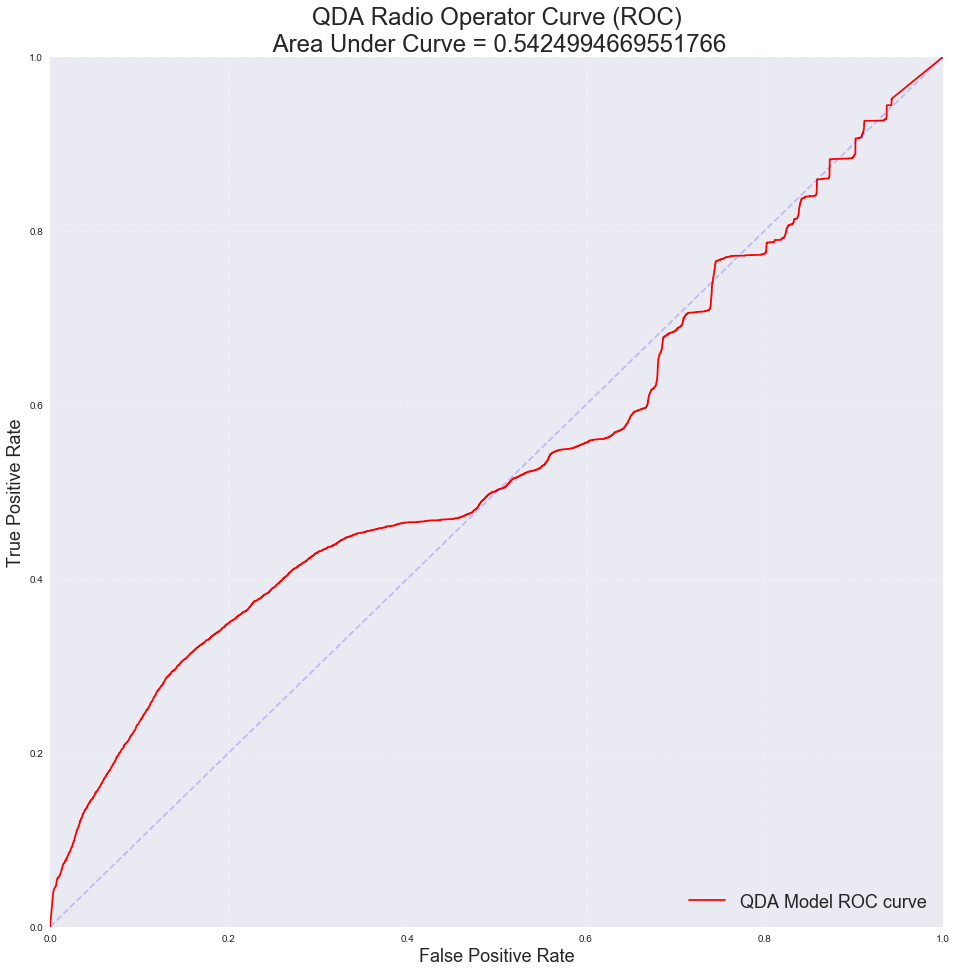
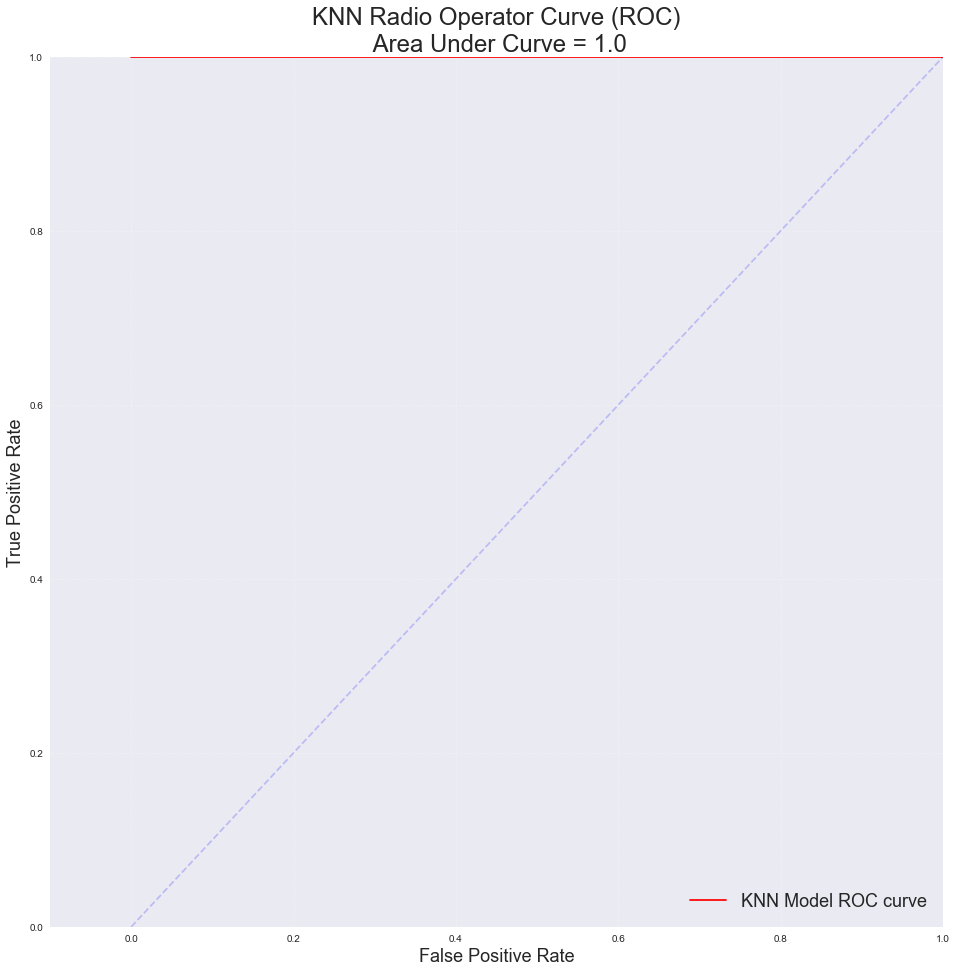

# Simple Models


```python
# Basic tools
import warnings
warnings.filterwarnings('ignore')
import numpy as np
import pandas as pd
import matplotlib
import matplotlib.pyplot as plt
import seaborn as sns
from pandas.core import datetools
from pandas.plotting import scatter_matrix
%matplotlib inline
import nbconvert
import statsmodels.api as sm
from statsmodels.api import OLS

# Preprocessing tools
from sklearn                import preprocessing
from sklearn.preprocessing  import PolynomialFeatures
from sklearn.preprocessing  import StandardScaler
from sklearn.preprocessing  import Imputer

# Metrics tools
from sklearn                import metrics
from sklearn.metrics        import confusion_matrix
from sklearn.metrics        import mean_squared_error
from sklearn.metrics        import accuracy_score
from sklearn.metrics        import confusion_matrix
from sklearn.metrics        import r2_score

# Discriminant Analysis tools
from sklearn.discriminant_analysis import LinearDiscriminantAnalysis
from sklearn.discriminant_analysis import QuadraticDiscriminantAnalysis

# Model selection tools
from sklearn.model_selection import cross_val_score
from sklearn.model_selection import LeaveOneOut
from sklearn.model_selection import KFold
from sklearn.model_selection import train_test_split

# Linear Regression Models
from sklearn.linear_model    import Ridge
from sklearn.linear_model    import Lasso
from sklearn.linear_model    import RidgeCV
from sklearn.linear_model    import LassoCV
from sklearn.linear_model    import LinearRegression
from sklearn.linear_model    import SGDClassifier
from sklearn.linear_model    import LogisticRegression
from sklearn.linear_model    import LogisticRegressionCV


# Classifiers
from sklearn.neighbors       import KNeighborsClassifier
from sklearn.tree            import DecisionTreeClassifier

```


```python
def split_X_y(filename):
    df=pd.read_csv(filename,index_col=0)
    return df.drop('bot_or_not',axis=1), df.bot_or_not


def how_many_uniques(df):
    for col in df.columns:
        try:
            print(col,len(df[col].unique()))
        except:
            print(col, "length undefined")
    return None
```


```python
def visualize_prob(model, x, y, ax):
    # Use the model to predict probabilities for
    y_pred = model.predict_proba(x)
    
    # Separate the predictions on the label 1 and label 0 points
    ypos = y_pred[y==1]
    yneg = y_pred[y==0]
    
    # Count the number of label 1 and label 0 points
    npos = ypos.shape[0]
    nneg = yneg.shape[0]
    
    # Plot the probabilities on a vertical line at x = 0, 
    # with the positive points in blue and negative points in red
    pos_handle = ax.plot(np.zeros((npos,1)), ypos[:,1], 'bo', label = 'Cancer Type 1')
    neg_handle = ax.plot(np.zeros((nneg,1)), yneg[:,1], 'ro', label = 'Cancer Type 0')

    # Line to mark prob 0.5
    ax.axhline(y = 0.5, color = 'k', linestyle = '--')
    
    # Add y-label and legend, do not display x-axis, set y-axis limit
    ax.set_ylabel('Probability of AML class')
    ax.legend(loc = 'best')
    ax.get_xaxis().set_visible(False)
    ax.set_ylim([0,1])
    
    
    
#--------  plot_decision_boundary
# A function that visualizes the data and the decision boundaries
# Input: 
#      x (predictors)
#      y (labels)
#      model (the classifier you want to visualize)
#      title (title for plot)
#      ax (a set of axes to plot on)
#      poly_degree (highest degree of polynomial terms included in the model; None by default)

def plot_decision_boundary(x, y, model, title, ax, poly_degree=None):
    # Create mesh
    # Interval of points for biomarker 1
    min0 = x[:,0].min()
    max0 = x[:,0].max()
    interval0 = np.arange(min0, max0, (max0-min0)/100)
    n0 = np.size(interval0)
    
    # Interval of points for biomarker 2
    min1 = x[:,1].min()
    max1 = x[:,1].max()
    interval1 = np.arange(min1, max1, (max1-min1)/100)
    n1 = np.size(interval1)

    # Create mesh grid of points
    x1, x2 = np.meshgrid(interval0, interval1)
    x1 = x1.reshape(-1,1)
    x2 = x2.reshape(-1,1)
    xx = np.concatenate((x1, x2), axis=1)

    # Predict on mesh of points
    # Check if polynomial terms need to be included
    if(poly_degree!=None):
        # Use PolynomialFeatures to generate polynomial terms
        poly = PolynomialFeatures(poly_degree,include_bias = False)
        xx_ = poly.fit_transform(xx)
        yy = model.predict(xx_) 
        
    else:   
        yy = model.predict(xx)
        
    yy = yy.reshape((n0, n1))

    # Plot decision surface
    x1 = x1.reshape(n0, n1)
    x2 = x2.reshape(n0, n1)
    ax.contourf(x1, x2, yy, cmap=plt.cm.coolwarm, alpha=0.8)
    
    # Plot scatter plot of data
    yy = y.reshape(-1,)
    ax.scatter(x[yy==1,0], x[yy==1,1], c='blue', label='Normal', cmap=plt.cm.coolwarm)
    ax.scatter(x[yy==2,0], x[yy==2,1], c='cyan', label='Hyper', cmap=plt.cm.coolwarm)
    ax.scatter(x[yy==3,0], x[yy==3,1], c='red', label='Hypo', cmap=plt.cm.coolwarm)
    
    # Label axis, title
    ax.set_title(title)
    ax.set_xlabel('Biomarker 1')
    ax.set_ylabel('Biomarker 2')
```


```python
X_train, y_train = split_X_y("BASELINE_train.csv")
```


```python
df = pd.read_csv("BASELINE_train.csv", index_col=0)
```


```python
X_test, y_test = split_X_y("BASELINE_test.csv")
```


```python
X_train.head()
```


<div>
<style scoped>
    .dataframe tbody tr th:only-of-type {
        vertical-align: middle;
    }

    .dataframe tbody tr th {
        vertical-align: top;
    }

    .dataframe thead th {
        text-align: right;
    }
</style>
<table border="1" class="dataframe">
  <thead>
    <tr style="text-align: right;">
      <th></th>
      <th>retweet_count</th>
      <th>favorite_count</th>
      <th>user_verified</th>
      <th>user_followers_count</th>
      <th>user_friends_count</th>
      <th>user_listed_count</th>
      <th>user_favourites_count</th>
      <th>user_statuses_count</th>
      <th>user_geo_enabled</th>
      <th>word_count</th>
      <th>char_count</th>
      <th>avg_word</th>
      <th>stopwords</th>
      <th>num_hashtags</th>
      <th>numerics</th>
      <th>upper</th>
      <th>sentiment_polarity</th>
      <th>sentiment_subjectivity</th>
    </tr>
  </thead>
  <tbody>
    <tr>
      <th>24564</th>
      <td>0.0</td>
      <td>1.0</td>
      <td>0</td>
      <td>428</td>
      <td>2817</td>
      <td>10</td>
      <td>9009</td>
      <td>1265</td>
      <td>0</td>
      <td>19</td>
      <td>140</td>
      <td>6.421053</td>
      <td>5</td>
      <td>0</td>
      <td>0</td>
      <td>2</td>
      <td>0.00</td>
      <td>0.0000</td>
    </tr>
    <tr>
      <th>86602</th>
      <td>0.0</td>
      <td>0.0</td>
      <td>0</td>
      <td>149</td>
      <td>611</td>
      <td>3</td>
      <td>818</td>
      <td>1010</td>
      <td>1</td>
      <td>22</td>
      <td>140</td>
      <td>5.409091</td>
      <td>8</td>
      <td>0</td>
      <td>0</td>
      <td>0</td>
      <td>0.00</td>
      <td>0.0000</td>
    </tr>
    <tr>
      <th>4709</th>
      <td>0.0</td>
      <td>0.0</td>
      <td>0</td>
      <td>124</td>
      <td>137</td>
      <td>5</td>
      <td>35615</td>
      <td>24248</td>
      <td>1</td>
      <td>12</td>
      <td>68</td>
      <td>4.750000</td>
      <td>0</td>
      <td>0</td>
      <td>0</td>
      <td>11</td>
      <td>-1.00</td>
      <td>1.0000</td>
    </tr>
    <tr>
      <th>23732</th>
      <td>3.0</td>
      <td>0.0</td>
      <td>0</td>
      <td>954</td>
      <td>1849</td>
      <td>1</td>
      <td>8603</td>
      <td>7470</td>
      <td>0</td>
      <td>23</td>
      <td>140</td>
      <td>5.363636</td>
      <td>6</td>
      <td>0</td>
      <td>0</td>
      <td>1</td>
      <td>0.15</td>
      <td>0.4125</td>
    </tr>
    <tr>
      <th>98687</th>
      <td>0.0</td>
      <td>0.0</td>
      <td>0</td>
      <td>8</td>
      <td>63</td>
      <td>0</td>
      <td>172</td>
      <td>32</td>
      <td>0</td>
      <td>17</td>
      <td>144</td>
      <td>7.529412</td>
      <td>3</td>
      <td>0</td>
      <td>0</td>
      <td>0</td>
      <td>0.85</td>
      <td>1.0000</td>
    </tr>
  </tbody>
</table>
</div>


```python
y_train.head()
```


    24564    0.0
    86602    0.0
    4709     0.0
    23732    0.0
    98687    1.0
    Name: bot_or_not, dtype: float64


```python
# Baseline model is Logistic Regression Clasification model
model_baseline = LogisticRegression(C=10000000)
model_baseline.fit(X_train,y_train)
```


    LogisticRegression(C=10000000, class_weight=None, dual=False,
              fit_intercept=True, intercept_scaling=1, max_iter=100,
              multi_class='ovr', n_jobs=1, penalty='l2', random_state=None,
              solver='liblinear', tol=0.0001, verbose=0, warm_start=False)


```python
# Getting training accuracy score of baseline model
accuracy_score(y_train,model_baseline.predict(X_train))
```


    0.906928044529709


```python
model_baseline.score(X_test,y_test)
```


    0.9044376899696048


## LDA and QDA


```python
lda = LinearDiscriminantAnalysis().fit(X_train, y_train)
qda = QuadraticDiscriminantAnalysis().fit(X_train, y_train)
```


```python
lda.score(X_test,y_test)
```


    0.8993313069908815


```python
qda.score(X_test,y_test)
```


    0.3417629179331307


## k-NN with Cross Validation


```python
max_score = 0
max_k = 0 

for k in range(1,26):
    knn = KNeighborsClassifier(n_neighbors = k)
    score = cross_val_score(knn,X_train,y_train).mean()
    if score > max_score:
        max_k = k
        max_score = score
        
knn = KNeighborsClassifier(n_neighbors = max_k)
knn.fit(X_train,y_train)
```


```python
knn.score(X_test,y_test)
```


    0.9914893617021276


```python
len(X_test)
```


    8225


```python
len(X_test)*knn.score(X_test,y_test)
```


    8155.0


## Confusion Matrices


```python
cfm_logit = confusion_matrix(y_train,model_baseline.predict(X_train))
cfm_lda = confusion_matrix(y_train,lda.predict(X_train))
cfm_qda = confusion_matrix(y_train,qda.predict(X_train))
cfm_knn = confusion_matrix(y_train,knn.predict(X_train))

df_log=pd.DataFrame(cfm_logit, columns=['Predicted 0','Predicted 1'], index=['Actually 0','Actually 1'])
df_lda=pd.DataFrame(cfm_lda, columns=['Predicted 0','Predicted 1'], index=['Actually 0','Actually 1'])
df_qda=pd.DataFrame(cfm_qda, columns=['Predicted 0','Predicted 1'], index=['Actually 0','Actually 1'])
df_knn=pd.DataFrame(cfm_knn, columns=['Predicted 0','Predicted 1'], index=['Actually 0','Actually 1'])

```


```python
df_log
```


<div>
<style scoped>
    .dataframe tbody tr th:only-of-type {
        vertical-align: middle;
    }

    .dataframe tbody tr th {
        vertical-align: top;
    }

    .dataframe thead th {
        text-align: right;
    }
</style>
<table border="1" class="dataframe">
  <thead>
    <tr style="text-align: right;">
      <th></th>
      <th>Predicted 0</th>
      <th>Predicted 1</th>
    </tr>
  </thead>
  <tbody>
    <tr>
      <th>Actually 0</th>
      <td>65975</td>
      <td>187</td>
    </tr>
    <tr>
      <th>Actually 1</th>
      <td>6702</td>
      <td>1154</td>
    </tr>
  </tbody>
</table>
</div>


```python
df_lda
```


<div>
<style scoped>
    .dataframe tbody tr th:only-of-type {
        vertical-align: middle;
    }

    .dataframe tbody tr th {
        vertical-align: top;
    }

    .dataframe thead th {
        text-align: right;
    }
</style>
<table border="1" class="dataframe">
  <thead>
    <tr style="text-align: right;">
      <th></th>
      <th>Predicted 0</th>
      <th>Predicted 1</th>
    </tr>
  </thead>
  <tbody>
    <tr>
      <th>Actually 0</th>
      <td>65793</td>
      <td>369</td>
    </tr>
    <tr>
      <th>Actually 1</th>
      <td>6878</td>
      <td>978</td>
    </tr>
  </tbody>
</table>
</div>


```python
df_qda
```


<div>
<style scoped>
    .dataframe tbody tr th:only-of-type {
        vertical-align: middle;
    }

    .dataframe tbody tr th {
        vertical-align: top;
    }

    .dataframe thead th {
        text-align: right;
    }
</style>
<table border="1" class="dataframe">
  <thead>
    <tr style="text-align: right;">
      <th></th>
      <th>Predicted 0</th>
      <th>Predicted 1</th>
    </tr>
  </thead>
  <tbody>
    <tr>
      <th>Actually 0</th>
      <td>20692</td>
      <td>45470</td>
    </tr>
    <tr>
      <th>Actually 1</th>
      <td>2531</td>
      <td>5325</td>
    </tr>
  </tbody>
</table>
</div>


```python
df_knn
```


<div>
<style scoped>
    .dataframe tbody tr th:only-of-type {
        vertical-align: middle;
    }

    .dataframe tbody tr th {
        vertical-align: top;
    }

    .dataframe thead th {
        text-align: right;
    }
</style>
<table border="1" class="dataframe">
  <thead>
    <tr style="text-align: right;">
      <th></th>
      <th>Predicted 0</th>
      <th>Predicted 1</th>
    </tr>
  </thead>
  <tbody>
    <tr>
      <th>Actually 0</th>
      <td>66162</td>
      <td>0</td>
    </tr>
    <tr>
      <th>Actually 1</th>
      <td>0</td>
      <td>7856</td>
    </tr>
  </tbody>
</table>
</div>


## Test Set Confusion Matrix


```python
cfm_logit_test = confusion_matrix(y_test,model_baseline.predict(X_test))
cfm_lda_test = confusion_matrix(y_test,lda.predict(X_test))
cfm_qda_test = confusion_matrix(y_test,qda.predict(X_test))
cfm_knn_test = confusion_matrix(y_test,knn.predict(X_test))

df_log_test=pd.DataFrame(cfm_logit_test, columns=['Predicted 0','Predicted 1'], index=['Actually 0','Actually 1'])
df_lda_test=pd.DataFrame(cfm_lda_test, columns=['Predicted 0','Predicted 1'], index=['Actually 0','Actually 1'])
df_qda_test=pd.DataFrame(cfm_qda_test, columns=['Predicted 0','Predicted 1'], index=['Actually 0','Actually 1'])
df_knn_test=pd.DataFrame(cfm_knn_test, columns=['Predicted 0','Predicted 1'], index=['Actually 0','Actually 1'])


```


```python
df_log_test
```


<div>
<style scoped>
    .dataframe tbody tr th:only-of-type {
        vertical-align: middle;
    }

    .dataframe tbody tr th {
        vertical-align: top;
    }

    .dataframe thead th {
        text-align: right;
    }
</style>
<table border="1" class="dataframe">
  <thead>
    <tr style="text-align: right;">
      <th></th>
      <th>Predicted 0</th>
      <th>Predicted 1</th>
    </tr>
  </thead>
  <tbody>
    <tr>
      <th>Actually 0</th>
      <td>7296</td>
      <td>26</td>
    </tr>
    <tr>
      <th>Actually 1</th>
      <td>760</td>
      <td>143</td>
    </tr>
  </tbody>
</table>
</div>


```python
df_lda_test
```


<div>
<style scoped>
    .dataframe tbody tr th:only-of-type {
        vertical-align: middle;
    }

    .dataframe tbody tr th {
        vertical-align: top;
    }

    .dataframe thead th {
        text-align: right;
    }
</style>
<table border="1" class="dataframe">
  <thead>
    <tr style="text-align: right;">
      <th></th>
      <th>Predicted 0</th>
      <th>Predicted 1</th>
    </tr>
  </thead>
  <tbody>
    <tr>
      <th>Actually 0</th>
      <td>7276</td>
      <td>46</td>
    </tr>
    <tr>
      <th>Actually 1</th>
      <td>782</td>
      <td>121</td>
    </tr>
  </tbody>
</table>
</div>


```python
df_qda_test
```


<div>
<style scoped>
    .dataframe tbody tr th:only-of-type {
        vertical-align: middle;
    }

    .dataframe tbody tr th {
        vertical-align: top;
    }

    .dataframe thead th {
        text-align: right;
    }
</style>
<table border="1" class="dataframe">
  <thead>
    <tr style="text-align: right;">
      <th></th>
      <th>Predicted 0</th>
      <th>Predicted 1</th>
    </tr>
  </thead>
  <tbody>
    <tr>
      <th>Actually 0</th>
      <td>2229</td>
      <td>5093</td>
    </tr>
    <tr>
      <th>Actually 1</th>
      <td>321</td>
      <td>582</td>
    </tr>
  </tbody>
</table>
</div>


```python
df_knn_test
```


<div>
<style scoped>
    .dataframe tbody tr th:only-of-type {
        vertical-align: middle;
    }

    .dataframe tbody tr th {
        vertical-align: top;
    }

    .dataframe thead th {
        text-align: right;
    }
</style>
<table border="1" class="dataframe">
  <thead>
    <tr style="text-align: right;">
      <th></th>
      <th>Predicted 0</th>
      <th>Predicted 1</th>
    </tr>
  </thead>
  <tbody>
    <tr>
      <th>Actually 0</th>
      <td>7288</td>
      <td>34</td>
    </tr>
    <tr>
      <th>Actually 1</th>
      <td>36</td>
      <td>867</td>
    </tr>
  </tbody>
</table>
</div>


```python
# Creating ROC Curve Data...
train_predict_proba=baseline_model.predict_proba(X_train)[:,1]
fpr,tpr,thresh=metrics.roc_curve(y_train,train_predict_proba)

# Getting Area Under ROC Curve...
metrics.roc_auc_score(y_train,train_predict_proba)
```


    0.7063402447618081


```python
fig, ax= plt.subplots(figsize=(16,16))
ax.plot(fpr, tpr, color='r', label='Baseline Logit Model ROC curve')
ax.plot([0, 1], [0, 1], color='b', ls='--', alpha = 0.2)
ax.set_xlim(0,1)
ax.set_ylim(0,1)
ax.set_xlabel('False Positive Rate', fontsize=18)
ax.set_ylabel('True Positive Rate', fontsize=18)
ax.set_title('Radio Operator Curve (ROC)\n Area Under Curve = 0.7063', fontsize=24)
ax.legend(loc="lower right", fontsize=18)
ax.grid(True, ls='--',alpha=0.2)
```





```python
# Creating ROC Curve Data...
lda_predict_proba=lda.predict_proba(X_train)[:,1]
lda_fpr,lda_tpr,lda_thresh=metrics.roc_curve(y_train,lda_predict_proba)

# Getting Area Under ROC Curve...
metrics.roc_auc_score(y_train,lda_predict_proba)
```


    0.731201974019704


```python
fig, ax= plt.subplots(figsize=(16,16))
ax.plot(lda_fpr,lda_tpr, color='r', label='LDA Model ROC curve')
ax.plot([0, 1], [0, 1], color='b', ls='--', alpha = 0.2)
ax.set_xlim(0,1)
ax.set_ylim(0,1)
ax.set_xlabel('False Positive Rate', fontsize=18)
ax.set_ylabel('True Positive Rate', fontsize=18)
ax.set_title('LDA Radio Operator Curve (ROC)\n Area Under Curve = '+str(metrics.roc_auc_score(y_train,lda_predict_proba)), fontsize=24)
ax.legend(loc="lower right", fontsize=18)
ax.grid(True, ls='--',alpha=0.2)
```





```python
# Creating ROC Curve Data...
qda_predict_proba=qda.predict_proba(X_train)[:,1]
qda_fpr,qda_tpr,qda_thresh=metrics.roc_curve(y_train,qda_predict_proba)

# Getting Area Under ROC Curve...
metrics.roc_auc_score(y_train,qda_predict_proba)
```


    0.5424994669551766


```python
fig, ax= plt.subplots(figsize=(16,16))
ax.plot(qda_fpr,qda_tpr, color='r', label='QDA Model ROC curve')
ax.plot([0, 1], [0, 1], color='b', ls='--', alpha = 0.2)
ax.set_xlim(0,1)
ax.set_ylim(0,1)
ax.set_xlabel('False Positive Rate', fontsize=18)
ax.set_ylabel('True Positive Rate', fontsize=18)
ax.set_title('QDA Radio Operator Curve (ROC)\n Area Under Curve = '+str(metrics.roc_auc_score(y_train,qda_predict_proba)), fontsize=24)
ax.legend(loc="lower right", fontsize=18)
ax.grid(True, ls='--',alpha=0.2)
```





```python
# Creating ROC Curve Data...
knn_predict_proba=knn.predict_proba(X_train)[:,1]
knn_fpr,knn_tpr,knn_thresh=metrics.roc_curve(y_train,knn_predict_proba)

# Getting Area Under ROC Curve...
metrics.roc_auc_score(y_train,knn_predict_proba)
```


    1.0


```python
fig, ax= plt.subplots(figsize=(16,16))
ax.plot(knn_fpr, knn_tpr, color='r', label='KNN Model ROC curve')
ax.plot([0, 1], [0, 1], color='b', ls='--', alpha = 0.2)
ax.set_xlim(-0.1,1)
ax.set_ylim(0,1)
ax.set_xlabel('False Positive Rate', fontsize=18)
ax.set_ylabel('True Positive Rate', fontsize=18)
ax.set_title('KNN Radio Operator Curve (ROC)\n Area Under Curve = '+str(metrics.roc_auc_score(y_train,knn_predict_proba)), fontsize=24)
ax.legend(loc="lower right", fontsize=18)
ax.grid(True, ls='--',alpha=0.2)
```





# Standardized Logistic Regression Classification


```python
entire = df.copy().drop(['id','text','user_screen_name'],axis=1)
```


```python
entire.to_csv("entire.csv")
```


```python
74018 + 8225
```


    82243


```python
df=pd.read_csv('baseline_final.csv', index_col=0)
```


```python
train, test = train_test_split(df, test_size=0.1)
```


```python
len(train)
```


    74018


```python
len(test)
```


    8225


```python
train2.to_csv('BASELINE_train.csv')
test2.to_csv('BASELINE_test.csv')
```


```python
train = pd.read_csv('BASELINE_train.csv')
test = pd.read_csv('BASELINE_test.csv')

X_train = train.drop('bot_or_not',axis=1)
y_train = train.bot_or_not

X_test = test.drop('bot_or_not',axis=1)
y_test = test.bot_or_not

```


```python
train2.drop('bot_or_not', axis=1)
test2.drop('bot_or_not', axis=1)
```


<div>
<style scoped>
    .dataframe tbody tr th:only-of-type {
        vertical-align: middle;
    }

    .dataframe tbody tr th {
        vertical-align: top;
    }

    .dataframe thead th {
        text-align: right;
    }
</style>
<table border="1" class="dataframe">
  <thead>
    <tr style="text-align: right;">
      <th></th>
      <th>retweet_count</th>
      <th>favorite_count</th>
      <th>user_verified</th>
      <th>user_followers_count</th>
      <th>user_friends_count</th>
      <th>user_listed_count</th>
      <th>user_favourites_count</th>
      <th>user_statuses_count</th>
      <th>user_geo_enabled</th>
      <th>word_count</th>
      <th>char_count</th>
      <th>avg_word</th>
      <th>stopwords</th>
      <th>num_hashtags</th>
      <th>numerics</th>
      <th>upper</th>
      <th>sentiment_polarity</th>
      <th>sentiment_subjectivity</th>
      <th>bot_or_not</th>
    </tr>
  </thead>
  <tbody>
    <tr>
      <th>24564</th>
      <td>0.0</td>
      <td>1.0</td>
      <td>0</td>
      <td>428</td>
      <td>2817</td>
      <td>10</td>
      <td>9009</td>
      <td>1265</td>
      <td>0</td>
      <td>19</td>
      <td>140</td>
      <td>6.421053</td>
      <td>5</td>
      <td>0</td>
      <td>0</td>
      <td>2</td>
      <td>0.00</td>
      <td>0.0000</td>
      <td>0.0</td>
    </tr>
    <tr>
      <th>86602</th>
      <td>0.0</td>
      <td>0.0</td>
      <td>0</td>
      <td>149</td>
      <td>611</td>
      <td>3</td>
      <td>818</td>
      <td>1010</td>
      <td>1</td>
      <td>22</td>
      <td>140</td>
      <td>5.409091</td>
      <td>8</td>
      <td>0</td>
      <td>0</td>
      <td>0</td>
      <td>0.00</td>
      <td>0.0000</td>
      <td>0.0</td>
    </tr>
    <tr>
      <th>4709</th>
      <td>0.0</td>
      <td>0.0</td>
      <td>0</td>
      <td>124</td>
      <td>137</td>
      <td>5</td>
      <td>35615</td>
      <td>24248</td>
      <td>1</td>
      <td>12</td>
      <td>68</td>
      <td>4.750000</td>
      <td>0</td>
      <td>0</td>
      <td>0</td>
      <td>11</td>
      <td>-1.00</td>
      <td>1.0000</td>
      <td>0.0</td>
    </tr>
    <tr>
      <th>23732</th>
      <td>3.0</td>
      <td>0.0</td>
      <td>0</td>
      <td>954</td>
      <td>1849</td>
      <td>1</td>
      <td>8603</td>
      <td>7470</td>
      <td>0</td>
      <td>23</td>
      <td>140</td>
      <td>5.363636</td>
      <td>6</td>
      <td>0</td>
      <td>0</td>
      <td>1</td>
      <td>0.15</td>
      <td>0.4125</td>
      <td>0.0</td>
    </tr>
    <tr>
      <th>98687</th>
      <td>0.0</td>
      <td>0.0</td>
      <td>0</td>
      <td>8</td>
      <td>63</td>
      <td>0</td>
      <td>172</td>
      <td>32</td>
      <td>0</td>
      <td>17</td>
      <td>144</td>
      <td>7.529412</td>
      <td>3</td>
      <td>0</td>
      <td>0</td>
      <td>0</td>
      <td>0.85</td>
      <td>1.0000</td>
      <td>1.0</td>
    </tr>
  </tbody>
</table>
</div>


```python
train2 = train.copy().drop(['id','text','user_screen_name'],axis=1)
test2 = test.copy().drop(['id','text','user_screen_name'],axis=1)
standardize.fit_transform(train2)
standardize.transform(test2)
```


    array([[-0.27883035,  0.709526  , -0.08723352, ...,  0.17978823,
             1.44309932, -0.34458504],
           [-0.27930556, -0.07383499, -0.08723352, ..., -0.16131675,
            -0.94724898, -0.34458504],
           [-0.27730969, -0.07383499, -0.08723352, ...,  1.54420812,
             0.5467187 , -0.34458504],
           ...,
           [-0.27930556,  0.02408514, -0.08723352, ...,  0.43561696,
            -0.12556675, -0.34458504],
           [-0.27930556,  0.02408514, -0.08723352, ..., -0.16131675,
            -0.94724898, -0.34458504],
           [ 0.28989911, -0.07383499, -0.08723352, ..., -0.16131675,
            -0.94724898, -0.34458504]])


```python
len(X_train.columns)
```


    18


```python
X_train = train.copy().drop(['id','text','user_screen_name','bot_or_not'],axis=1)
X_test = test.copy().drop(['id','text','user_screen_name','bot_or_not'],axis=1)

y_train = train.copy().bot_or_not
y_test = test.copy().bot_or_not

```


```python
X_train[X_train.columns[:6]].describe()
```


<div>
<style scoped>
    .dataframe tbody tr th:only-of-type {
        vertical-align: middle;
    }

    .dataframe tbody tr th {
        vertical-align: top;
    }

    .dataframe thead th {
        text-align: right;
    }
</style>
<table border="1" class="dataframe">
  <thead>
    <tr style="text-align: right;">
      <th></th>
      <th>retweet_count</th>
      <th>favorite_count</th>
      <th>user_verified</th>
      <th>user_followers_count</th>
      <th>user_friends_count</th>
      <th>user_listed_count</th>
    </tr>
  </thead>
  <tbody>
    <tr>
      <th>count</th>
      <td>74018.000000</td>
      <td>74018.000000</td>
      <td>74018.000000</td>
      <td>74018.000000</td>
      <td>74018.000000</td>
      <td>74018.000000</td>
    </tr>
    <tr>
      <th>mean</th>
      <td>2938.768948</td>
      <td>0.754033</td>
      <td>0.007552</td>
      <td>3742.578805</td>
      <td>3126.097544</td>
      <td>36.028966</td>
    </tr>
    <tr>
      <th>std</th>
      <td>10521.769750</td>
      <td>10.212474</td>
      <td>0.086575</td>
      <td>17147.982473</td>
      <td>8315.257636</td>
      <td>201.250359</td>
    </tr>
    <tr>
      <th>min</th>
      <td>0.000000</td>
      <td>0.000000</td>
      <td>0.000000</td>
      <td>0.000000</td>
      <td>1.000000</td>
      <td>0.000000</td>
    </tr>
    <tr>
      <th>25%</th>
      <td>0.000000</td>
      <td>0.000000</td>
      <td>0.000000</td>
      <td>157.000000</td>
      <td>418.750000</td>
      <td>0.000000</td>
    </tr>
    <tr>
      <th>50%</th>
      <td>22.000000</td>
      <td>0.000000</td>
      <td>0.000000</td>
      <td>708.000000</td>
      <td>1366.000000</td>
      <td>2.000000</td>
    </tr>
    <tr>
      <th>75%</th>
      <td>1283.000000</td>
      <td>0.000000</td>
      <td>0.000000</td>
      <td>2266.000000</td>
      <td>3086.000000</td>
      <td>13.000000</td>
    </tr>
    <tr>
      <th>max</th>
      <td>676415.000000</td>
      <td>1846.000000</td>
      <td>1.000000</td>
      <td>309686.000000</td>
      <td>109562.000000</td>
      <td>3463.000000</td>
    </tr>
  </tbody>
</table>
</div>


```python
X_train[X_train.columns[6:12]].describe()
```


<div>
<style scoped>
    .dataframe tbody tr th:only-of-type {
        vertical-align: middle;
    }

    .dataframe tbody tr th {
        vertical-align: top;
    }

    .dataframe thead th {
        text-align: right;
    }
</style>
<table border="1" class="dataframe">
  <thead>
    <tr style="text-align: right;">
      <th></th>
      <th>user_favourites_count</th>
      <th>user_statuses_count</th>
      <th>user_geo_enabled</th>
      <th>word_count</th>
      <th>char_count</th>
      <th>avg_word</th>
    </tr>
  </thead>
  <tbody>
    <tr>
      <th>count</th>
      <td>74018.000000</td>
      <td>74018.000000</td>
      <td>74018.000000</td>
      <td>74018.000000</td>
      <td>74018.000000</td>
      <td>74018.000000</td>
    </tr>
    <tr>
      <th>mean</th>
      <td>16713.490381</td>
      <td>18461.785728</td>
      <td>0.298103</td>
      <td>17.463536</td>
      <td>118.120052</td>
      <td>6.180276</td>
    </tr>
    <tr>
      <th>std</th>
      <td>30154.250907</td>
      <td>38003.190466</td>
      <td>0.457428</td>
      <td>6.401627</td>
      <td>33.455307</td>
      <td>1.752336</td>
    </tr>
    <tr>
      <th>min</th>
      <td>0.000000</td>
      <td>1.000000</td>
      <td>0.000000</td>
      <td>1.000000</td>
      <td>4.000000</td>
      <td>1.389831</td>
    </tr>
    <tr>
      <th>25%</th>
      <td>1254.000000</td>
      <td>1396.000000</td>
      <td>0.000000</td>
      <td>13.000000</td>
      <td>100.000000</td>
      <td>5.086957</td>
    </tr>
    <tr>
      <th>50%</th>
      <td>5174.000000</td>
      <td>5406.000000</td>
      <td>0.000000</td>
      <td>19.000000</td>
      <td>139.000000</td>
      <td>5.714286</td>
    </tr>
    <tr>
      <th>75%</th>
      <td>18894.000000</td>
      <td>18816.000000</td>
      <td>1.000000</td>
      <td>22.000000</td>
      <td>140.000000</td>
      <td>6.777778</td>
    </tr>
    <tr>
      <th>max</th>
      <td>291007.000000</td>
      <td>450059.000000</td>
      <td>1.000000</td>
      <td>107.000000</td>
      <td>158.000000</td>
      <td>30.000000</td>
    </tr>
  </tbody>
</table>
</div>


```python
X_train[X_train.columns[12:18]].describe()
```


<div>
<style scoped>
    .dataframe tbody tr th:only-of-type {
        vertical-align: middle;
    }

    .dataframe tbody tr th {
        vertical-align: top;
    }

    .dataframe thead th {
        text-align: right;
    }
</style>
<table border="1" class="dataframe">
  <thead>
    <tr style="text-align: right;">
      <th></th>
      <th>stopwords</th>
      <th>num_hashtags</th>
      <th>numerics</th>
      <th>upper</th>
      <th>sentiment_polarity</th>
      <th>sentiment_subjectivity</th>
    </tr>
  </thead>
  <tbody>
    <tr>
      <th>count</th>
      <td>74018.000000</td>
      <td>74018.000000</td>
      <td>74018.000000</td>
      <td>74018.000000</td>
      <td>74018.000000</td>
      <td>74018.000000</td>
    </tr>
    <tr>
      <th>mean</th>
      <td>4.867843</td>
      <td>0.216299</td>
      <td>0.090708</td>
      <td>1.545124</td>
      <td>0.047292</td>
      <td>0.317025</td>
    </tr>
    <tr>
      <th>std</th>
      <td>3.249893</td>
      <td>0.727510</td>
      <td>0.371422</td>
      <td>2.033847</td>
      <td>0.293167</td>
      <td>0.334682</td>
    </tr>
    <tr>
      <th>min</th>
      <td>0.000000</td>
      <td>0.000000</td>
      <td>0.000000</td>
      <td>0.000000</td>
      <td>-1.000000</td>
      <td>0.000000</td>
    </tr>
    <tr>
      <th>25%</th>
      <td>2.000000</td>
      <td>0.000000</td>
      <td>0.000000</td>
      <td>1.000000</td>
      <td>0.000000</td>
      <td>0.000000</td>
    </tr>
    <tr>
      <th>50%</th>
      <td>5.000000</td>
      <td>0.000000</td>
      <td>0.000000</td>
      <td>1.000000</td>
      <td>0.000000</td>
      <td>0.233333</td>
    </tr>
    <tr>
      <th>75%</th>
      <td>7.000000</td>
      <td>0.000000</td>
      <td>0.000000</td>
      <td>2.000000</td>
      <td>0.136364</td>
      <td>0.575000</td>
    </tr>
    <tr>
      <th>max</th>
      <td>18.000000</td>
      <td>12.000000</td>
      <td>16.000000</td>
      <td>31.000000</td>
      <td>1.000000</td>
      <td>1.000000</td>
    </tr>
  </tbody>
</table>
</div>


```python
y_train.head()
```


    24564    0.0
    86602    0.0
    4709     0.0
    23732    0.0
    98687    1.0
    Name: bot_or_not, dtype: float64


```python
standardize = StandardScaler()
```
